<p align="center">
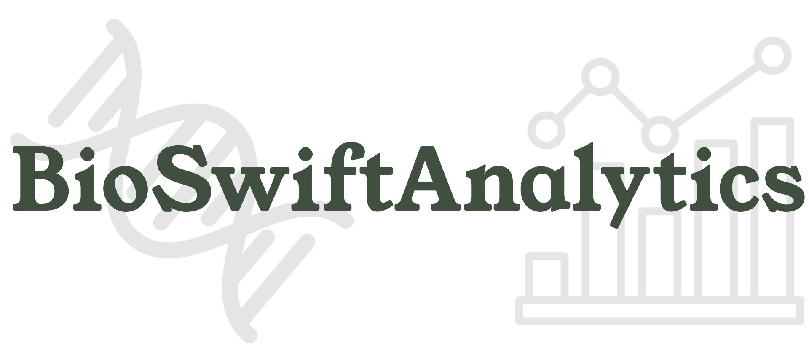
</p>

# BioSwiftAnalytics

**Welcome to the Biological Data Analysis repository!**

This repository contains a collection of Jupyter notebooks designed to simplify the analysis of biological data.

There are two main notebook groups for two different biological research fields:

- Transcriptomic data analysis
- Genomic data analysis

## Notebook Descriptions

### 1. AnnoRate: Hit Rate Comparison

**Group:** Transcriptomic data analysis.

**Input:** Input transcriptome (pep and cds) and Diamond/BLAST alignment  results (in TSV format).

This notebook analyzes the hit percentages for sequences across various databases. It evaluates the performance of a database in comparison to an input transcriptome. The notebook accepts a Fasta-format transcriptome file and a TSV-format alignment output from tools like Diamond or BLAST. It calculates hit percentages and generates a summary table, aiding users in assessing database coverage and specificity. This analysis helps select the most suitable database for a specific analysis.
<p align="center">
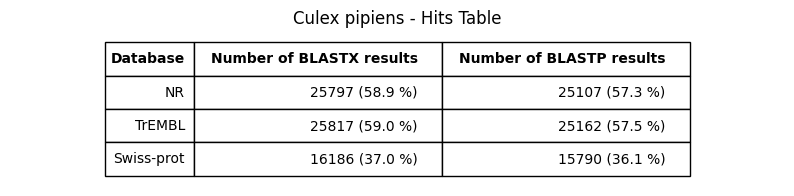
</p>

### 2. AnnoDegsReport: Multi-database Annotation Summary

**Group:** Transcriptomic data analysis.

**Input:** ALL BLAST/Diamond alignment TSV results (blastx and blastp vs all database) and Deseq2 output table.

This notebook is capable of generating summary reports in XSLX or TSV format, consolidating the annotation results of a specific transcriptome obtained by running alignment software (Diamond and BLAST) against various sequence databases. Additionally, this notebook can create links to the accession numbers for the input transcript sequences that mapped to the database, as well as resources on the NCBI and UniProt portals.

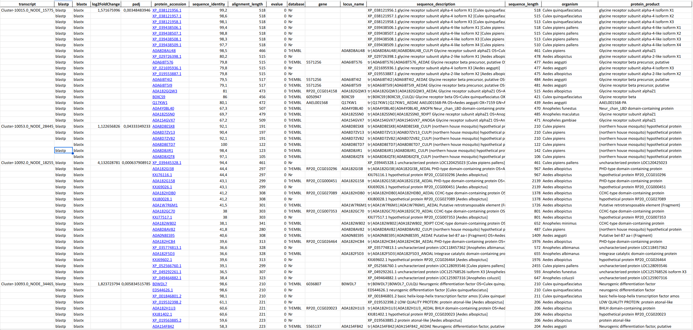

### 3.AnnoViz: A Jupyter Notebook for Enhanced Annotation Result Interpretation

**Group:** Transcriptomic data analysis.

**Input:** One single BLAST/Diamond alignment TSV result.

This notebook takes as input the output file generated by annotation software (BLAST or Diamond) and creates graphs that provide an interpretation of the annotation and alignment results. It offers valuable insights into the transcripts that have mapped to the database.

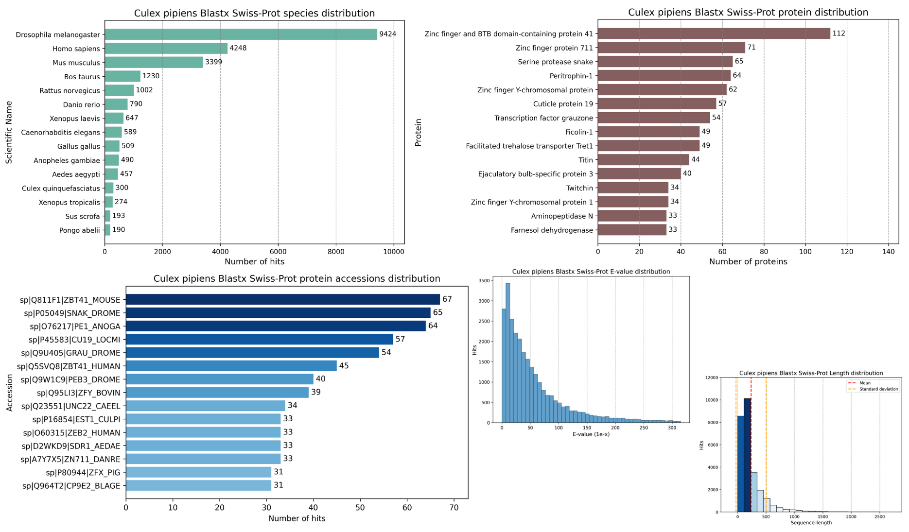

### 4. MultiVenn: A Jupyter Notebook for Comparing Annotation Results Across Databases Using Venn Diagrams

**Group:** Transcriptomic data analysis.

**Input:** Species specific Diamond/BLAST annotation TSV results across multiple databases.

Venn diagrams are a powerful visualization tool used in many areas of research, including bioinformatics. They are typically used to show the overlap between different sets or categories of data. In the context of omics data analysis, Venn diagrams can help identify common or unique hits across multiple databases or analyses, providing insights into the relationships between different datasets. In addition to the traditional Venn diagram, there are also variations such as Euler diagrams and Edwards-Venn diagrams, which can provide different types of visual representations of the data.
<p align="center">
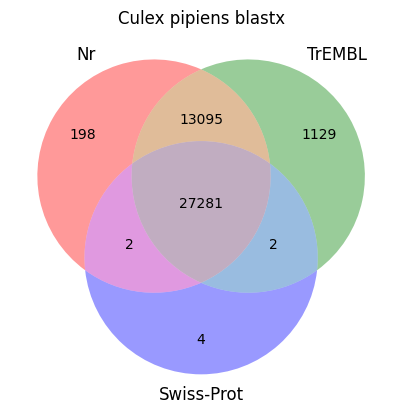
</p>
<br>
<br>

This notebook is able to interpret tab-separated value (TSV) files resulting from annotation software (BLAST/Diamond) and allows the generation of Venn diagrams that visualize the distribution of hits for each sequence in different databases. This allows biologists or bioinformaticians to verify the common hits among databases and how the matches are distributed.

### 5. Busco result plots - BASE

**Group:** Genomic data analysis.

**Input:** BUSCO output directory (json summary).

This Jupyter notebook is capable of creating a bar chart that represents the results from the analysis of the BUSCO software through bar diagrams. A bar chart of the results of a BUSCO (Benchmarking Universal Single-Copy Orthologs) completeness analysis is a visualization that can be extremely useful for assessing the quality of a genetic or genomic assembly. This type of chart represents the percentage of universal orthologous genes present in the assembly compared to the reference gene set.

<p>
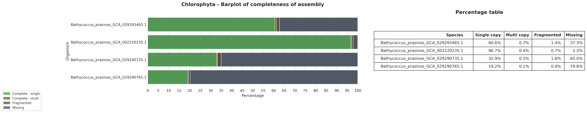
<em>4.1 Barplot and percentage table of various genes of Bathycoccus_prasinos genome quality assesement against Chlorophyta databases</em>
</p>
<p>
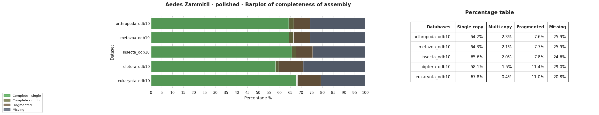
<em>4.2 Barplot and percentage table of Aedes Zammitii genome quality assesement versus various BUSCO's databases.</em>
</p>


### 6. Busco result plots - ADVANCED

**Group:** Genomic data analysis.

This notebook leverages the scripts developed by the BUSCO analysis software developers to create graphs highlighting synteny present between the species under examination and the presence of biological markers.

**Synteny:**
Synteny refers to the conservation of the order and arrangement of genes or genomic sequences between two different species. A synteny graph shows how genomic regions or specific genes are arranged in the two species under examination. This type of graph allows for the comparison of genetic homology between different species and the identification of conserved regions throughout evolution.

<p align="center">
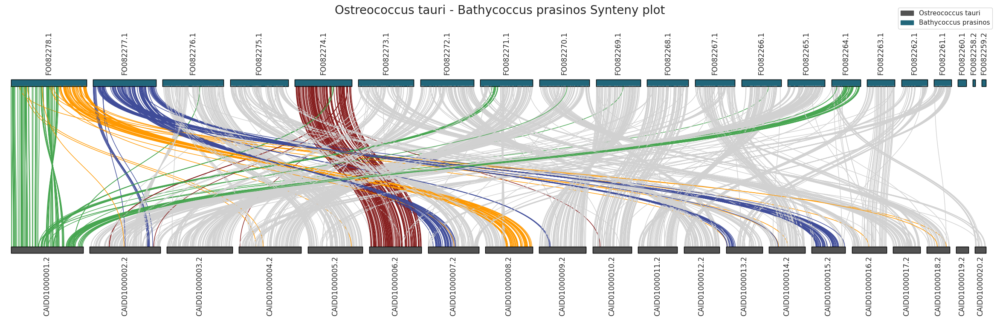
</p>
<br>

**Biological Markers:**
Biological markers, also known as molecular markers, are DNA or protein sequences used to identify specific genetic or genomic features. In synteny graphs, biological markers can be gene sequences, genomic regions, or other relevant features. These markers can be used to identify correspondences between species or to highlight events of gene duplication, inversion, translocation, or other genomic changes.

<p align="center">

</p>
<br>

**Phylogenomic tree:**
A phylogenomic tree is a type of tree diagram used to represent the evolutionary relationships between different species or groups of organisms. It is constructed based on a wide range of genetic and genomic data, typically derived from DNA or protein sequences. Phylogenomic trees provide insights into the evolutionary history and relatedness of species, helping scientists understand how different organisms are genetically connected.
<p align="center">
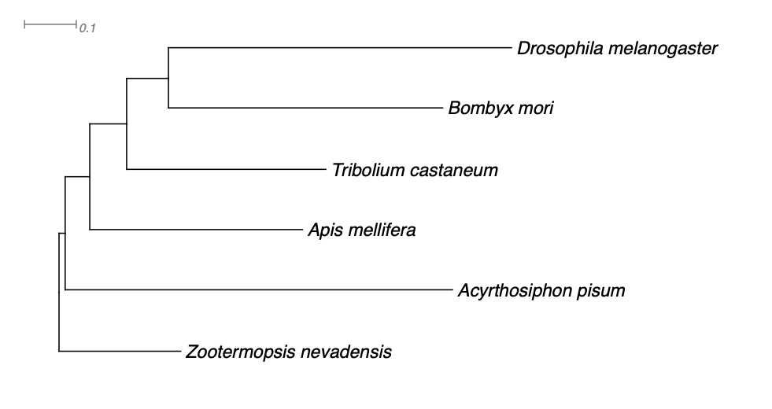
</p>
Thanks to this notebook, it is possible to create these graphs with user data using the R kernel installed in the notebook.

### 7. OrthoFinder result plots: A Jupyter Notebook for generating meaningful graphs and plots about your OrthoFinder data

**Group:** Genomic data analysis.

**Input:** OrthoFinder results directory.

OrthoFinder provides various information and results that are valuable for the analysis of orthologous gene families across different genomes.
With this notebook you can generate meaningful insight based on OrthoFinder results data. 

In particular, you can:

1. **Orthologous Gene Groups Venn diagram:** OrthoFinder identifies orthologous gene groups, which are sets of genes that share a common evolutionary ancestry and perform similar functions in different species. These groups are referred to as "ortholog clusters. The notebook can generate a Venn diagram that collect all Orthogroups.
<p align="center">
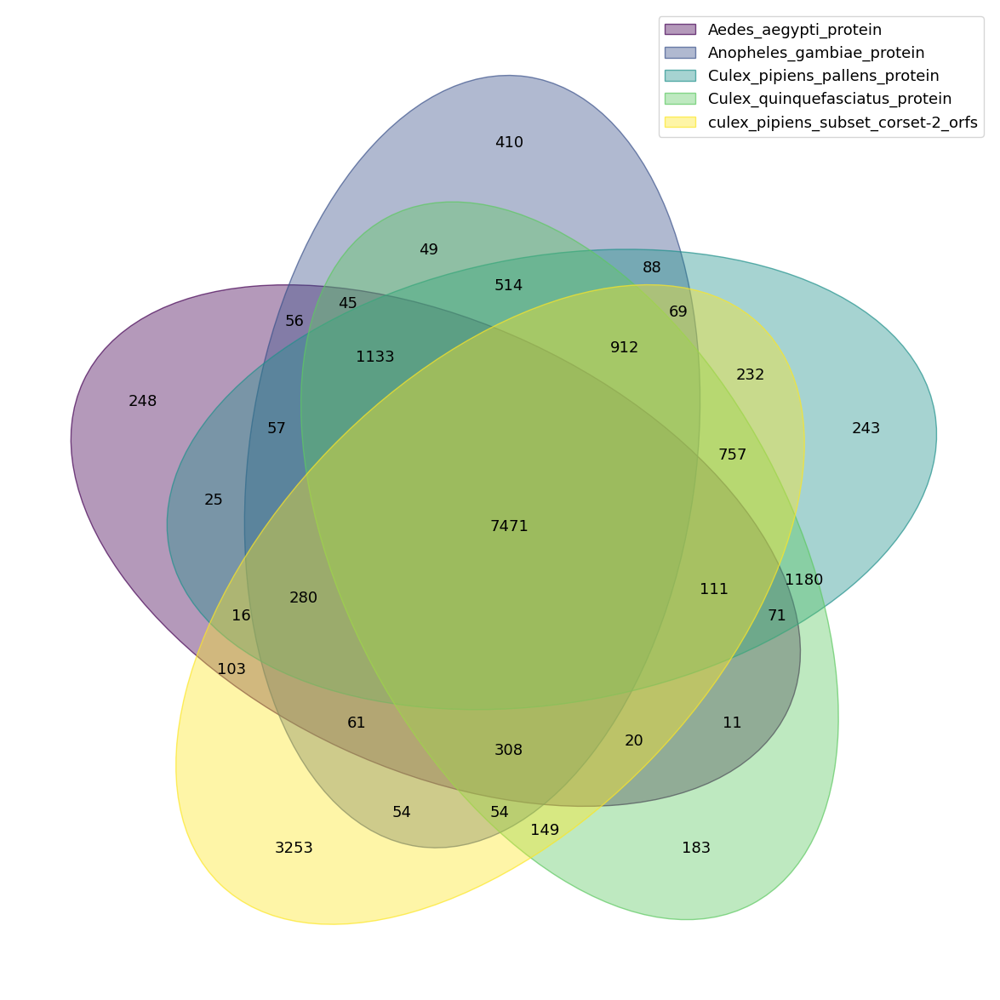
</p>

2. **Phylogenetic Trees:** For each ortholog cluster, OrthoFinder generates phylogenetic trees that depict the evolutionary relationships among orthologous genes in different species. This notebook provide a graphical representation of tree-based evolutionary relationships.
<p align="center">
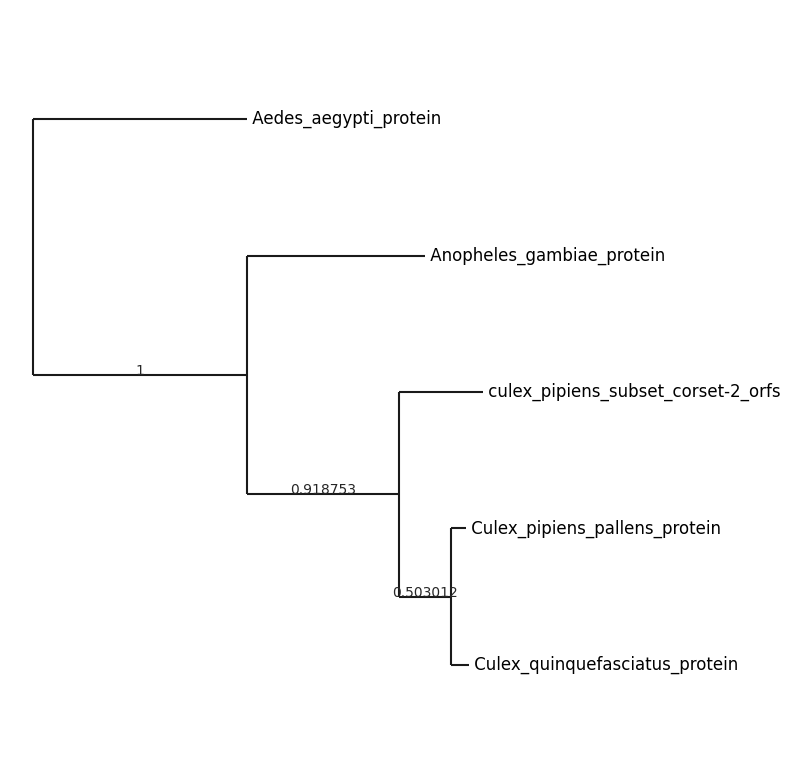
</p>

3. **Orthologue multiplicity:** It quantifies how many orthologous genes from different species are grouped together due to their shared evolutionary ancestry and similar functions. With this notebook you can plot these informations in a graphical way through a multi-label barplot.
<p align="center">
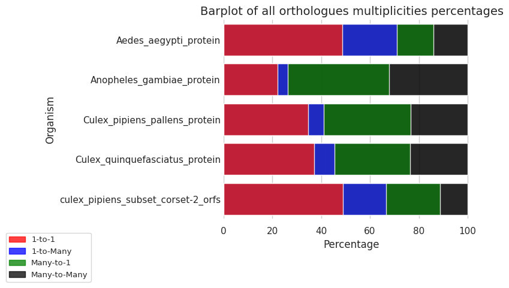
</p>

4. **Descriptive Statistics:** OrthoFinder offers descriptive statistics, such as the total number of ortholog clusters, the number of clusters with one gene from each species, and other useful metrics. This notebook can create a summary table with all these statistics.
<p align="center">
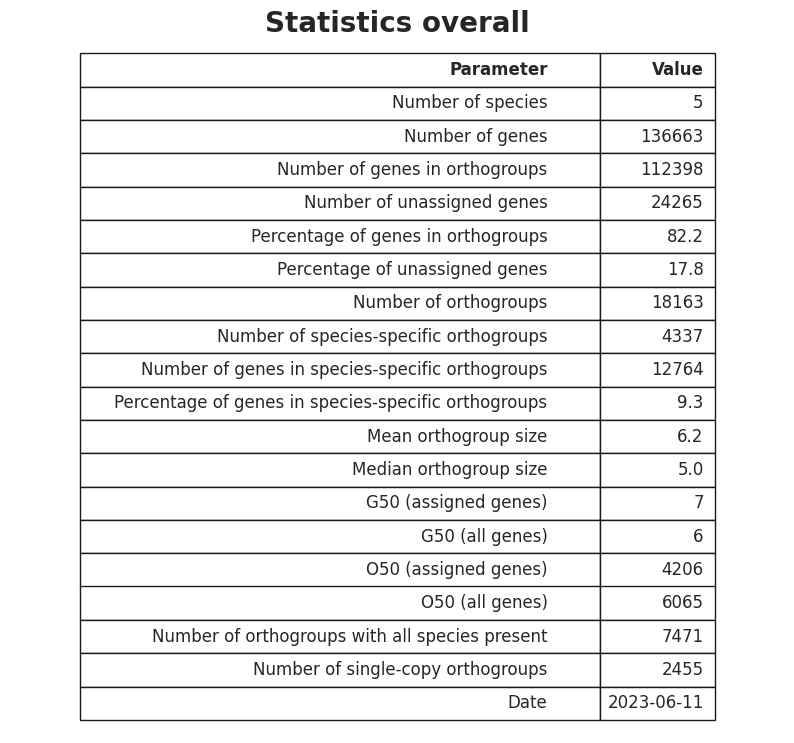
</p>

## Quick start

You can use these post-processing and analysis tools in two main modes:

1. ### Docker installation

    You can download the package (Docker image) containing all these tools and the Jupyter runtime environment using this command.

    ```sh
    docker pull lorenzoarcioni/bioswiftanalysis
    ```
    Once the image is downloaded you are ready to run the container!

    ```sh
    # Create first these two directories to link the container filesystem to the local filesystem
    mkdir data
    mkdir results
    ```
    ```sh
    docker run -p 8888:8888 -v $(pwd)/results:/home/jupyter/results/ -v $(pwd)/data/:/home/jupyter/data -d --name bioswiftanalytics lorenzoarcioni/bioswiftanalytics
    ```
    *Note that you can choose other ports instead of 8888:.*

    You can now open your web browser and access to the container at 127.0.0.1:8888 address.

    #### Container and local filesystem

    The container has two main directories:
    - The input data directory */home/jupyter/data/*
    - The output data directory */home/jupyter/results/*

    That are linked with your **\$(pwd)/data/** and **\$(pwd)/results/** on your local filesystem.

    This two directories allows you to transfer data for analysis into the container (by copying them to the directory **\$(pwd)/data/**) and obtain results (graphs, tables, etc.) directly on the local filesystem (in the directory **\$(pwd)/results/**).

    <p align="center">
    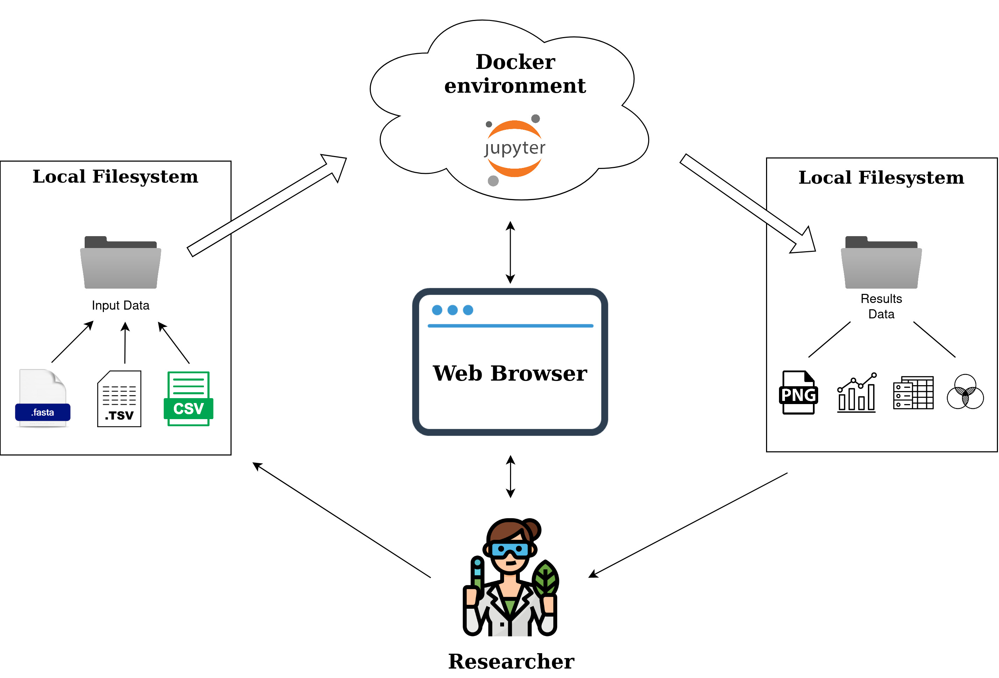
    </p>

    After the analysis process, you can stop and remove the docker container by using this command:
    ```sh
    docker stop bioswiftanalytics && docker remove bioswiftanalytics
    ```

2. ### Use all notebooks in your Jupyter environment

    You can download the last software release for downloading the latest version of all analysis notebook.

    Once downloaded the tar.gz archive, extract the archive with the following command
    ```sh
    tar -xzf [name of the archive] -C [name of the extraction directory]
    ```

    Once extracted, simply open the notebook with your Jupyter environment!

    *Note that the notebooks are developed with the same filesystem structure of the docker filesystem.*

## A simple illustration of software expected filesystem
```sh
your_current_directory/
|-- notebooks/
|   |-- AnnoRate.ipynb/
|   |-- AnnoReport.ipynb/
|   |-- AnnoViz.ipynb
|   |-- busco-base-plot.ipynb
|   |-- busco-advanced-plot.ipynb
|   |-- GO_analysis.ipynb
|   |-- GO_plot.ipynb
|   |-- MultiVenn.ipynb
|   |-- Orthofinder-plot.ipynb
|
|-- data/
|   |-- config/
|       |-- settings.conf
|
|-- results/
|   |-- logs/
|       |-- log1.txt
|       |-- log2.txt
```

Happy analyzing!
